# Lab Introduction

TOC

## Introduction to CloudForms

[General introduction](../../common/index.md)

## Access the lab environment

<!--
Navigate to the RHPDS Portal and order the "Getting Well With CloudForms" in the catalog "Cloud Infrastructure Demos".

[https://rhpds.redhat.com](https://rhpds.redhat.com)

If you've never used RHPDS before, make sure you follow the [Lab Environment Access Instructions](https://mojo.redhat.com/docs/DOC-1133834). In particular, request an account on the [OPENTLC Account Management Request Access](https://account.opentlc.com/account/requestAccessForm.php) page. If you only forgot your password, follow the instructions on the [OPENTLC Account Management](https://account.opentlc.com/account/) page.

After you logged in, navigate to ***Services*** -> ***Catalogs***. Open the "EMEA RHTE" Catalog.

Click on the "EMEA RHTE CF Lab" and click on ***Order*** to start deployment.

***Note:*** Give the lab up to 15 minutes to complete provisioning!

You will receive an email with the list of all virtual machines which have been deployed as part of the lab.
-->

The lab is comprised of a number of systems:

- Red Hat CloudForms Management Engine

        URL: https://cf-<GUID>.rhpds.opentlc.com

        User: admin / password: r3dh4t1!

- Red Hat Enterprise Virtualization Manager

        URL: https://rhevm-<GUID>.rhpds.opentlc.com

        User: admin@internal / password: r3dh4t1!

- VMware vCenter

        URL: https://vcenter-<GUID>.rhpds.opentlc.com

        User: administrator@vphere.local / password: Redhat1!

The ID &lt;GUID&gt; is unique to your lab environment.

***Note:*** Your browser might give you a warning message about the used SSL Certificates. These warning messages can be accepted and are due to the fact that each lab deployed with new certificates on request.

## Setting up the environment

### Environment architecture

As we explained before, your lab is built out of

- CloudForms 5.0 appliance

- RHV

- VMware

- Ansible Tower

***Note:*** This architecture is only for labs and POCs, and should never make it into any production-like environment, as it has one single appliance that will perform all the operations

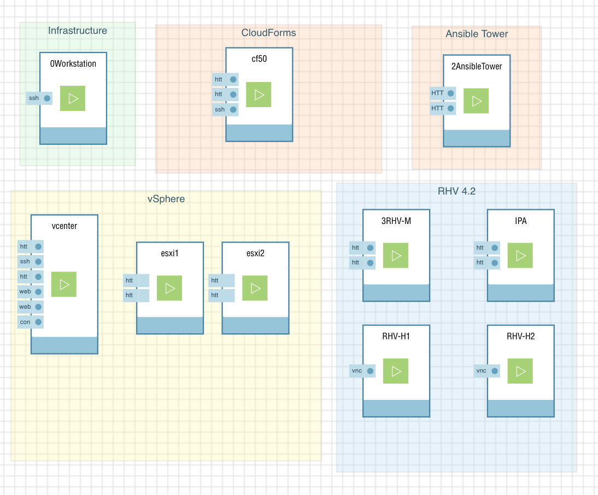

### Set up CloudForms

1. The first step is to initialize CloudForms. You need to ssh into the CloudForms appliance

        ssh root@cf-<GUID>.rhpds.opentlc.com

2. Then you need to access to the launch the `appliance_console` command that will bring you to the summary page of the appliance

        Welcome to the CFME Virtual Appliance.

        To modify the configuration, use a web browser to access the management page.

        Hostname:                cf.example.com
        IPv4 Address:            192.168.0.3/255.255.255.0
        IPv4 Gateway:            192.168.0.2
        IPv6 Address:
        IPV6 Gateway:
        Primary DNS:             192.168.0.1
        Secondary DNS:
        Search Order:            localdomain example.com
        MAC Address:             2c:c2:60:72:98:35
        Timezone:                America/New_York
        Local Database Server:   not initialized
        CFME Server:             not running
        CFME Database:           not configured
        Database/Region:         not configured
        External Auth:           not configured
        CFME Version:            5.11.1.2

        Press any key to continue.

3. After pressing any key, you will access to the main menu

        Advanced Setting

        1) Configure Network
        2) Set Timezone
        3) Set Date and Time
        4) Create Database Backup
        5) Create Database Dump
        6) Restore Database From Backup
        7) Configure Database
        8) Configure Database Replication
        9) Logfile Configuration
        10) Configure Application Database Failover Monitor
        11) Extend Temporary Storage
        12) Configure External Authentication (httpd)
        13) Update External Authentication Options
        14) Generate Custom Encryption Key
        15) Harden Appliance Using SCAP Configuration
        16) Stop EVM Server Processes
        17) Start EVM Server Processes
        18) Restart Appliance
        19) Shut Down Appliance
        20) Summary Information
        21) Quit

        Choose the advanced setting:

4. Select option `7) Configure Database`
5. Select option `1) Create key`
6. Select option `1) Create Internal Database` ***Note:*** For CloudForms 5.0 it is strongly recommended to create a stand alone Database.
7. Select option `2) /dev/vdb: 51200 MB`.
8. Select No to the question `Should this appliance run as a standalone database server?` ***Note:*** For CloudForms 5.0 it is strongly recommended to create a standalone Database.
9. Provide region number `0`.
10. Provide `smartvm`as the password for the database and verify it.
11. Wait few minutes until the configuration finishes.
12. Press any key to continue.
13. This will take you back to the summary screen. Please, note that now the CFME server is running

        Welcome to the CFME Virtual Appliance.

        To modify the configuration, use a web browser to access the management page.

        Hostname:                cf.example.com
        IPv4 Address:            192.168.0.3/255.255.255.0
        IPv4 Gateway:            192.168.0.2
        IPv6 Address:
        IPV6 Gateway:
        Primary DNS:             192.168.0.1
        Secondary DNS:
        Search Order:            localdomain example.com
        MAC Address:             2c:c2:60:72:98:35
        Timezone:                America/New_York
        Local Database Server:   running (primary)
        CFME Server:             running
        CFME Database:           localhost
        Database/Region:         vmdb_production / 0
        External Auth:           not configured
        CFME Version:            5.11.1.2

        Press any key to continue.

14. Press `21) Quit` to quit the console and exit the terminal

### Add the VMware Provider

Open the browser and point to [https://cf-<GUID>.rhpds.opentlc.com](https://cf-<GUID>.rhpds.opentlc.com) and login with user: `admin` and password `smartvm`

***Note*** if you get an error while connecting, please give some more time for the process to start. If you want to check if the service has started properly, run `systemctl status evmserverd`

Let's add the vCenter Provider:

1. Navigate to ***Compute*** -> ***Infrastructure*** -> ***Providers*** (in CloudForms 5.0 you should be here already when you log in) and click on Add Provider

    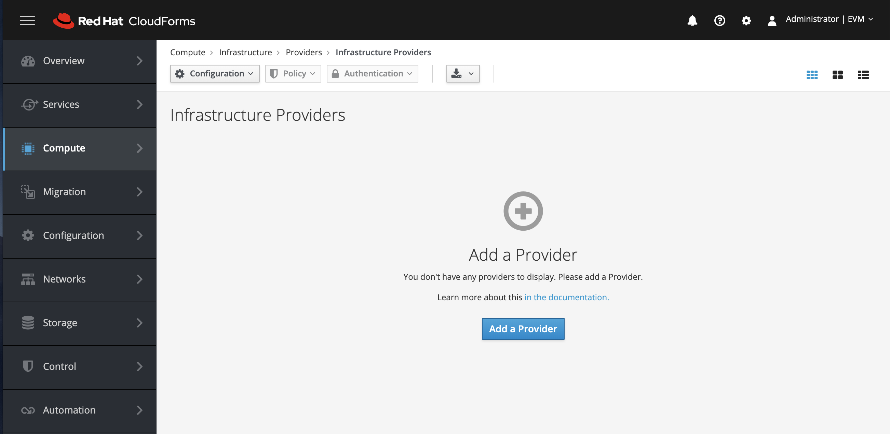

2. Provide all the required parameters

    **Name**: vCenter

    **Type**: VMware vCenter

    **Zone**: Default

    **Hostname**: 192.168.0.50

    **Username**: administrator@vsphere.local

    **Password**: Redhat1!

3. Click on `Validate`

4. Once the validation is successful, click on `Add`

    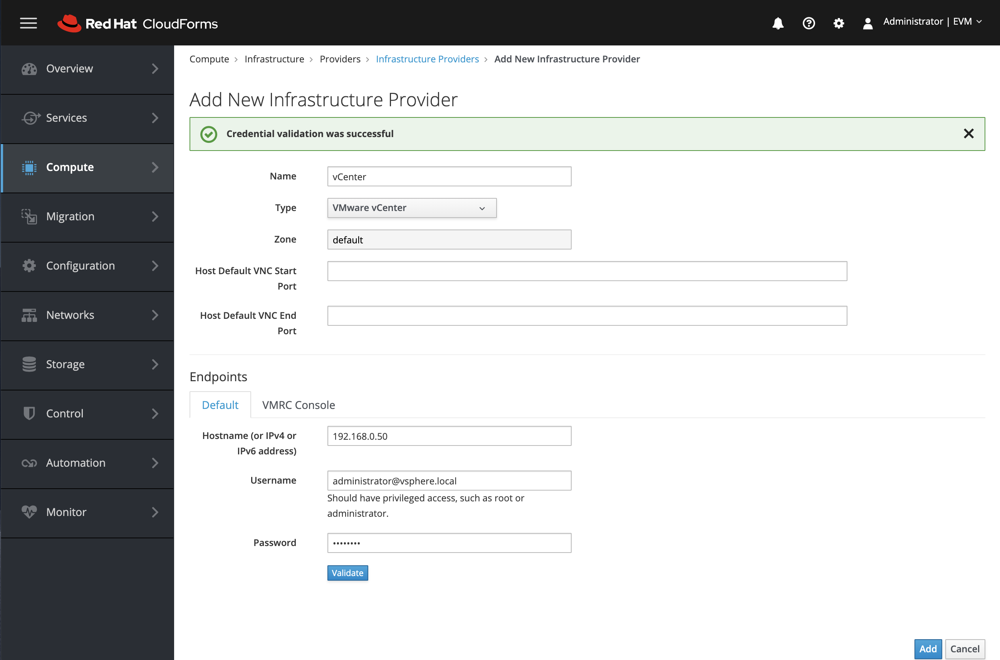

    ***Note:*** Please, give a couple of minutes to discover the information from the provider

5. Refresh the browser and you will get the updated info of the provider

<!--### Add Red Hat Virtualization Provider

Let's add the RHV Provider:

1. Navigate to ***Compute*** -> ***Infrastructure*** -> ***Providers***

    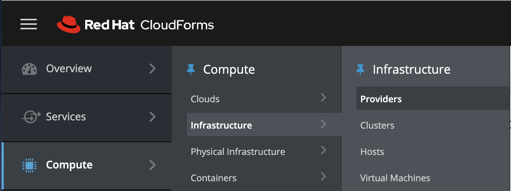

2. Click on ***Configuration*** -> ***Add a New Infrastructure Provider***

3. Provide all the required parameters

**Name**: RHV

**Type**: Red Hat Virtualization

**Zone**: Default

**Hostname**:

**Username**:

**Password**:

3. Click on `Validate`
4. Once the validation is successful, click on `Add`
-->

**Now you're ready to go!**

## CloudForms with Ansible

This part of the lab will guide you through the process of using the embedded Ansible features of CloudForms.

### Introduction to Ansible

Today, every business is a digital business. Technology is your innovation engine, and delivering your applications faster helps you win. Historically, that required a lot of manual effort and complicated coordination. But today, there is Ansible - the simple, yet powerful IT automation engine that thousands of companies are using to drive complexity out of their environments and accelerate DevOps initiatives.

Red Hat CloudForms can integrate with IaaS, PaaS, public and private cloud and configuration management providers.

This integration allows customers to build service catalogs from Ansible Playbooks to allow end users to easily browse, order and manage resources from Ansible. Ansible Playbooks can be used in Control Policies which can not only detect problems, but also automatically fix them.

### Make sure embedded Ansible role is enabled and running

Before we start,  we want to make sure the embedded Ansible role is enabled and running.

1. Log into your CloudForms Appliance

2. Locate, at the top right corner of the screen a little clockwork next to the your name that takes you to configuration

    

3. Click on "Embedded Ansible" Role to enable it

    

4. Click on Save

### Add a Git repository of Ansible Playbooks

To be able to run Ansible Playbooks, they have to become available in CloudForms. Custom git repositories can be used as well as Github, Gitlab or others. Other repository types like Subversion or Mercurial are planned for later versions.

1. Navigate to Automation, Ansible, Repositories.

    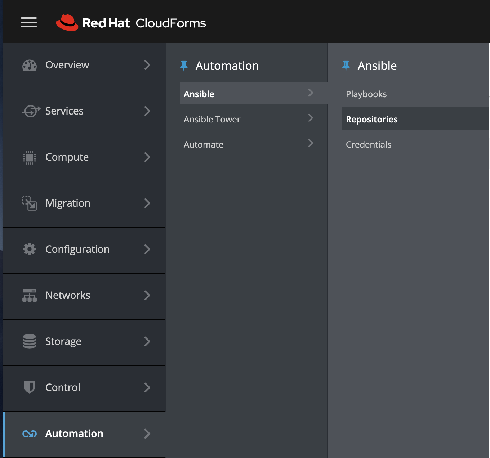

1. Click on ***Configuration***, ***Add New Repository***

1. Fill in the form.

    ***Name:*** Github

    ***Description:*** Example Playbooks

    ***URL:*** [https://github.com/vestival/Fast-Start-20.git](https://github.com/vestival/Fast-Start-20.git)

    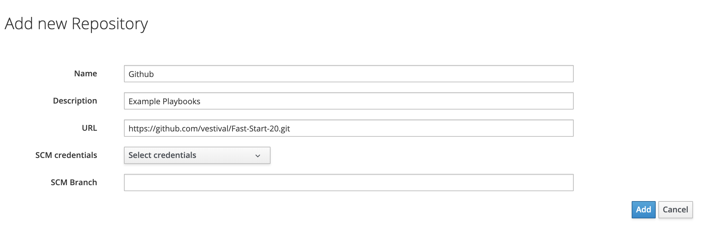

1. Click on ***Add*** to save the settings

***Note:*** It takes a few seconds for the action to complete.

### Add vCenter credentials

For one of the following labs, the Playbook needs to be able to log into the vCenter provider. For this to work, we need to store the necessary credentials.

1. Navigate to ***Automation*** -> ***Ansible*** -> ***Credentials***

    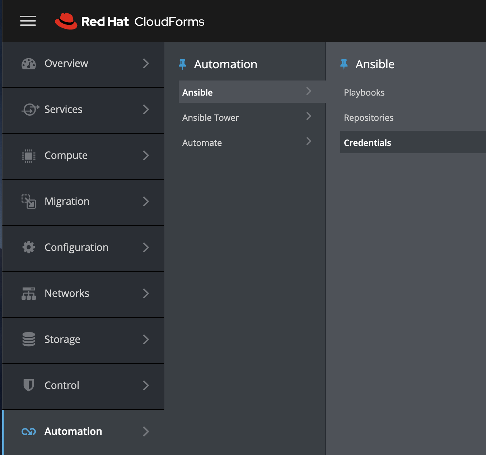

1. Click on ***Configuration*** -> ***Add New Credentials***

1. Provide the credentials in the form:

    ***Name:*** vCenter

    ***Credentials Type:*** VMware

    ***Username:*** administrator@vsphere.local

    ***Password:*** Redhat1!

    ***vCenter Host:*** 192.168.0.50.example.com

    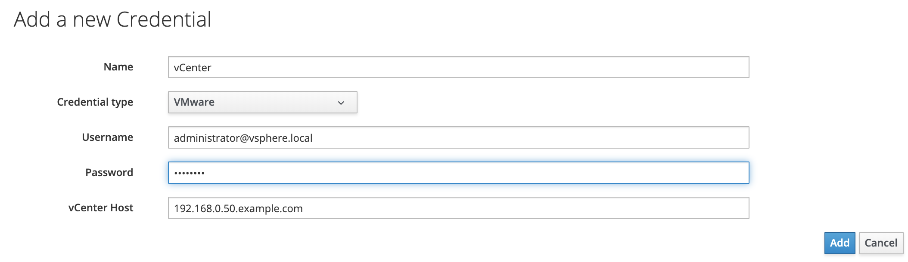

1. Click ***Add*** to save the credentials

***Note:*** It takes a few seconds for the action to complete.

### Verify repository sync

In the meantime the repository you created should have completed the initial synchronization. Let's check all Playbooks have been successfully imported and are available for us to use.

1. Navigate to ***Automation*** -> ***Ansible*** -> ***Playbooks***

    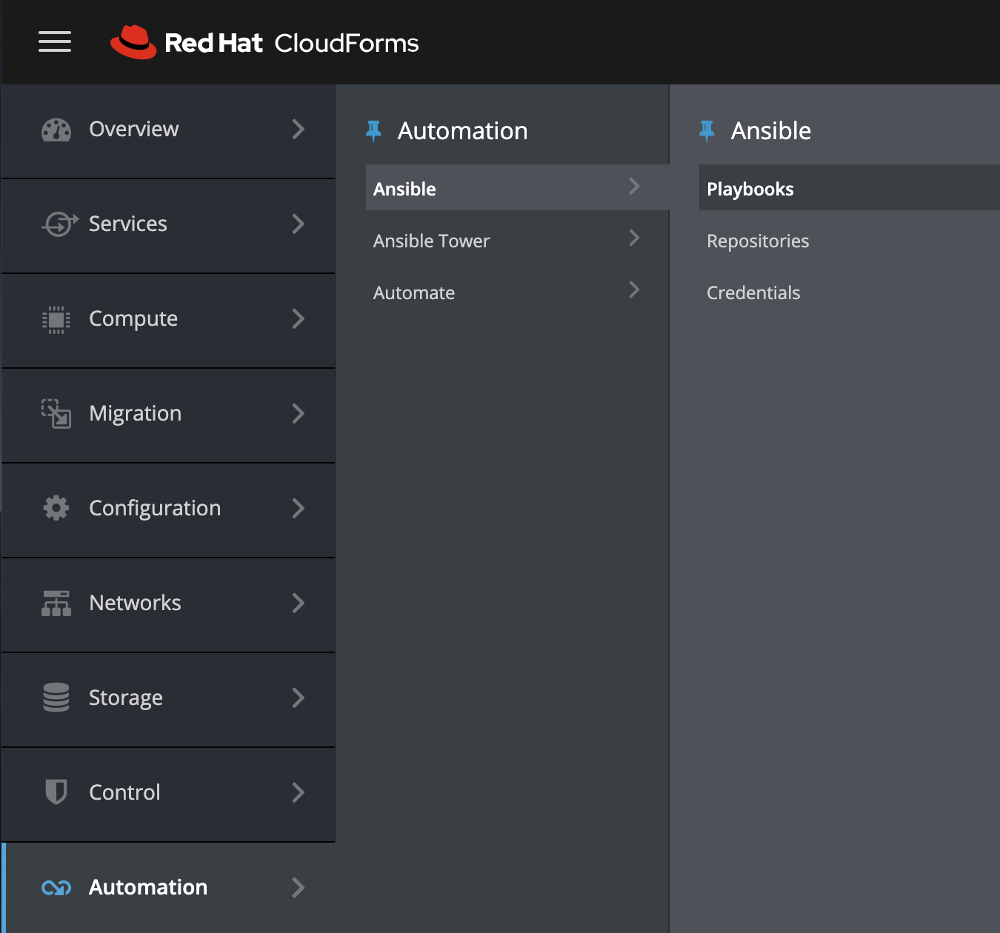

1. You should see a list of available Playbooks

    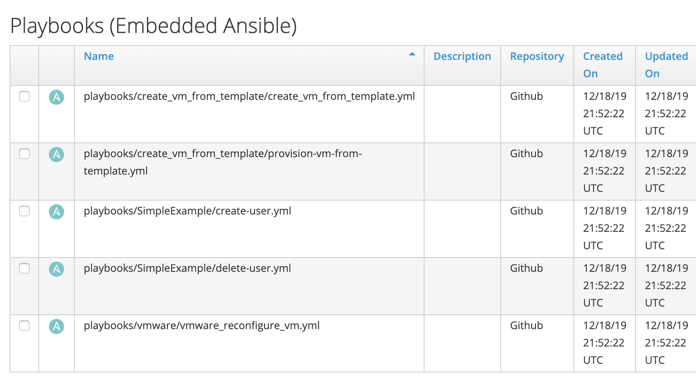

If there are no Playbooks listed, check the repository was configured correctly. Click the notification icon on the top right (the little bell icon) and check if there are any errors listed. The initial import can also take a minute or two, did you wait long enough?

### Install pyvmomi

In order to use the Ansible VMware modules you need to install a python library call "pyvmomi". You need to ssh to your CloudForms server.

`$ sudo pip3 install -U pyvmomi`

### Build a Service Catalog to create and delete users

In section of the lab we will use an Ansible Playbook to create a local user in CloudForms. This example will also demonstrate how we can define a retirement process as well. In CloudForms' understanding of complete life cycle management, every object has a provisioning and a retirement workflow.

### Create a Service Catalog for Ansible Playbooks

1. Navigate to ***Services*** -> ***Catalogs***

    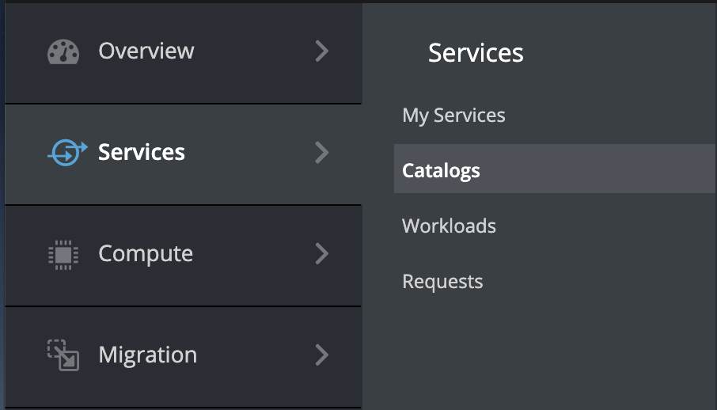

1. Click on ***Catalogs*** in the accordion on the left

1. Click on ***Configuration*** -> ***Add a New Catalog***

    ***Name:*** Ansible

    ***Description:*** Ansible Service Catalog Items

    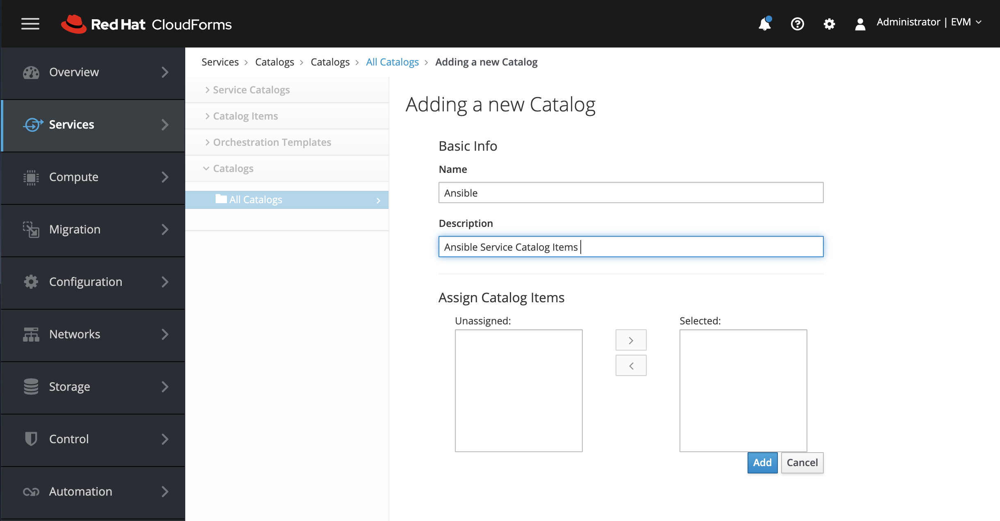

1. Click ***Add*** to save the new catalog

### Create a Service Catalog Item for the Playbook

1. Click on ***Catalog Items*** in the accordion on the left

    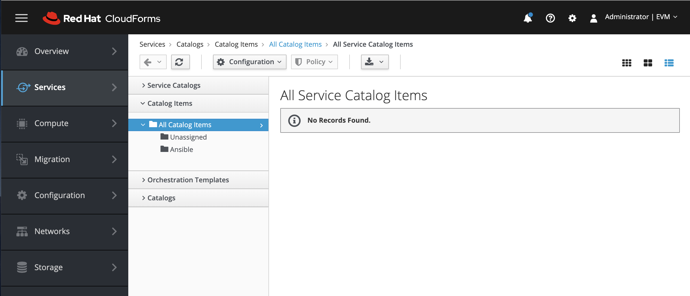

1. Click on ***Configuration*** -> ***Add a New Catalog Item***

1. Select ***Ansible Playbook*** as "Catalog Item Type"

    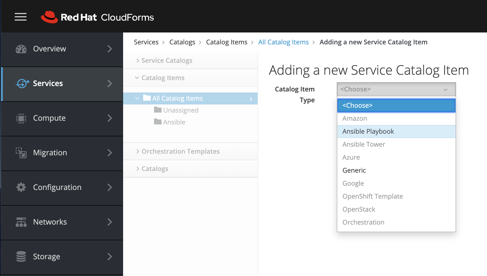

1. Fill out the form to define the service catalog item:

    ***Name:*** Create User

    ***Description:*** Order this catalog item to create a new user

    ***Display in Catalog:*** Yes (slide the button)

    ***Long description:*** Leave it blank

    ***Catalog:*** My Company/Ansible

    ***Repository:*** Github

    ***Playbook:*** create-user.yml

    ***Machine Credentials:*** CFME Default Credentials

    In the box ***Variables & Default Values*** we can enter the variables the Playbook requires:

    ***Variable:*** create_user_name

    ***Default:*** example

    Click on the little plus icon (+) to save the variable. Repeat the process for the second variable:

    ***Variable:*** create_user_password

    ***Default:*** secret

    Click on the little plus icon (+) to save the variable.

    ***Dialog:*** create new

    ***Dialog name:*** create-user

    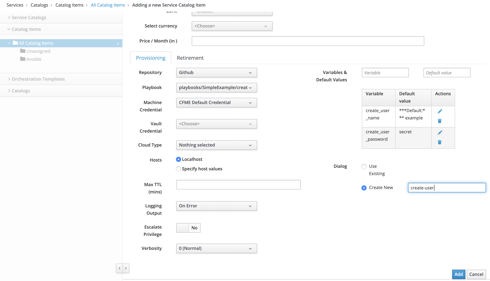

1. Click on the tab ***Retirement*** to switch to the second page of the form.

    ***Repository:*** Github

    ***Playbook:*** delete-user.yml

    ***Machine Credentials:*** CFME Default Credentials

    There are no variables needed for retirement and the ***Variables & Default Values*** can be left empty.

    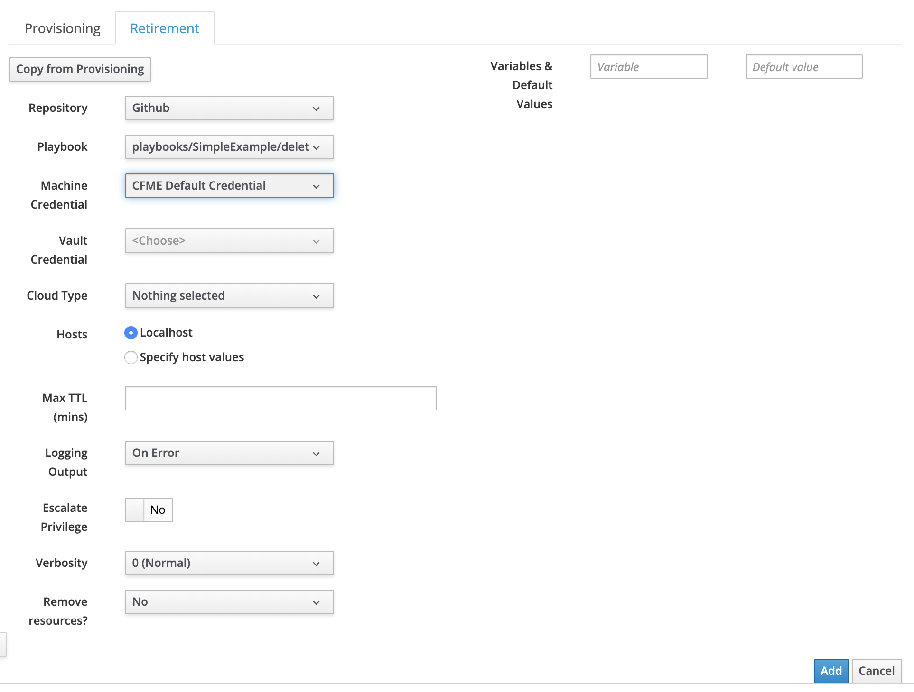

1. Click on ***Add*** to save the catalog item

### Order the "create user" Service Catalog Item

To make sure everything works as expected, we want to test the Catalog Item we just created.

1. Navigate to the Service Catalog by clicking on ***Services*** -> ***Catalogs***

    

1. Click on ***Service Catalog*** in the accordion on the left

1. Click on the Catalog Item you just created:

    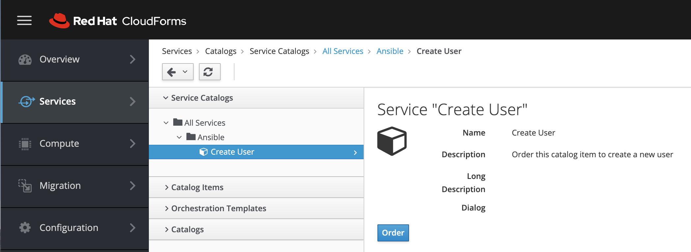

1. Click ***Order***

1. The default values in the form can be left alone. Optionally you can specify a different user name and password

    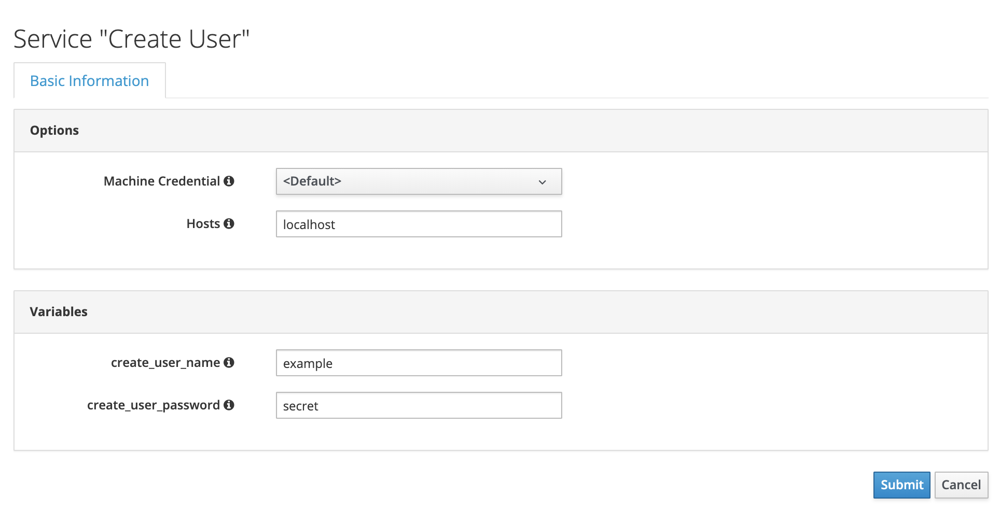

1. Click ***Submit***

    After clicking "Submit" you will be redirected to the Request Queue.

    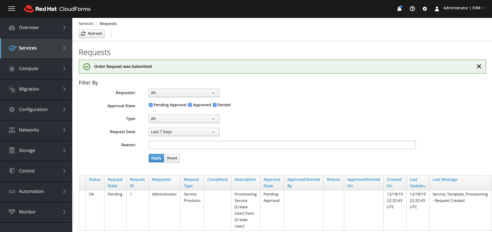

### Monitor create user Playbook execution

When executing an Ansible Playbook with the embedded role in CloudForms, a "Service" object is automatically created. This service object gives us more details about the executed Playbook. It provides the output of the Playbook and it allows us to trigger retirement.

1. Navigate to ***Services*** -> ***My Services***

    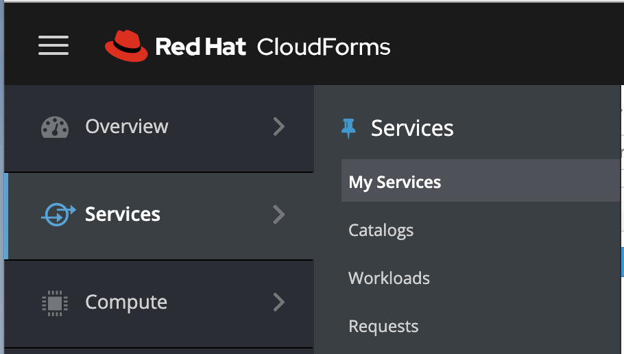

1. You should see a new tile representing the Ansible Playbook Service you just ordered

    ***Note:*** If you don't see the tile yet, wait a minute and try again.

    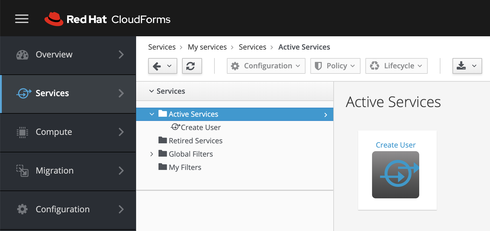

1. After clicking on the icon, we can see more details about the service which was created

    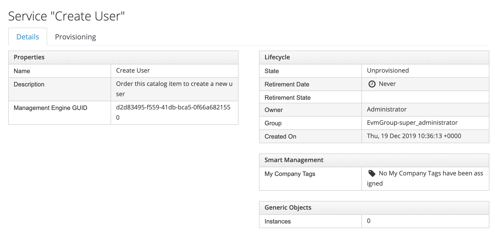

    Since this Service does not create a Virtual Machine, the box "VMs" will always say "No Records found"

1. Click on the ***Provisioning*** tab to see the output of the Ansible Playbook

    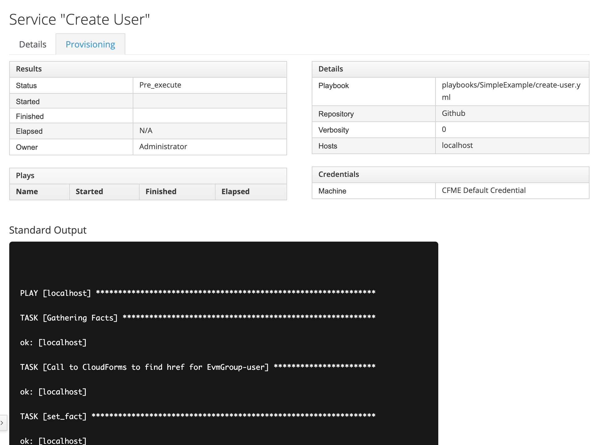

    If the Playbook execution has not completed, you can click the reload icon to refresh the information. The ***Reload*** icon is represented by two little arrows, left of the ***Configuration*** menu.

    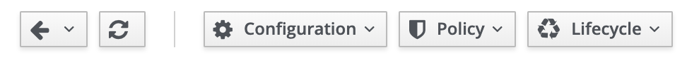

    ***Note:*** If the Playbook execution has not started yet, you might not see any details in the "Provisioning" tab. Wait a minute and reload once more.

### Verify Playbook results

To make sure the user was really created, follow these steps.

1. Click on the little clockwork near to your username on the top right

    

1. Click on ***Access Control*** in the accordion on the left

    

1. Click on ***Users*** and you should see the user you just created (in this screenshot the user is called "example")

    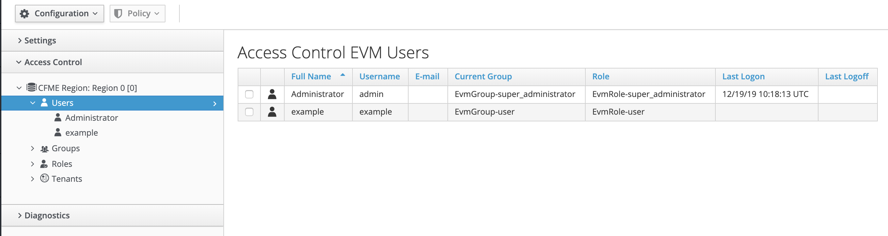

1. OPTIONALLY: If you want, you can log out of CloudForms and try to log in with the user you just created. Click on your username on the top right and ***Logout***.

    

<!--
### Build a Service Catalog to deploy Virtual Machines

In this second part of the lab we want to use an Ansible Playbook to deploy a Virtual Machine in VMware vCenter. The necessary Playbook should already be in your repository.

1. Click on ***Catalog Items*** in the accordion on the left

    

1. Click on ***Configuration*** -> ***Add a New Catalog Item***

1. Select ***Ansible Playbook*** as "Catalog Item Type"

    

    ***Note:*** Do not select Ansible Tower! We do not use Ansible Tower in this lab, but the embedded Ansible role of CloudForms.

1. Fill out the form to define the Service Catalog Item:

    The name of the Service Catalog Item:

    ***Name:*** Provision Virtual Machine

    More description details about the Service Catalog Item

    ***Description:*** Order this catalog item provision a Virtual Machine on VMware vCenter

    Slide this box to make the Service Catalog Item visible in the Service Catalog. This remains unselected for Service Catalog Items which are still in draft mode or should only be used as a part of a Service Catalog Bundle:

    ***Display in Catalog:*** Yes (slide the box)

    The Service Catalog in which this Service Catalog Item should be listed:

    ***Catalog:*** Ansible

    The Git repository from which we want to run our Playbook:

    ***Repository:*** Github

    The name of the actual Playbook:

    ***Playbook:*** create_vm_from_template.yml

    Credentials used to run the Playbook:

    ***Machine Credential:*** CFME Default Credentials

    ***Vault Credential:*** nothing

    If you want to run your Playbook against a Cloud Provider, you have to select which one:

    ***Cloud Type:*** VMware

    The credentials used to log into the Cloud Provider:

    ***Cloud Credentials:*** vCenter

    In the box ***Variables & Default Values*** we can enter the variables the Playbook requires. Those variables are defined in the Ansible Playbook. By specifying them here, CloudForms can populated those variables when somebody order the Service Catalog Item.

    If you want to learn more about variables in Ansible Playbooks, have a look at the [Ansible Documentation](http://docs.ansible.com/ansible/playbooks_variables.html).

    ***Variable:*** vcenter_hostname

    ***Default:*** 192.168.0.50

    Click on the little plus icon (+) to save the variable. Repeat the process for the second variable:

    ***Variable:*** esxi_host

    ***Default:*** 192.168.0.51

    Click on the little plus icon (+) to save the variable. Repeat the process for the second variable:

    ***Variable:*** datacenter

    ***Default:*** DC01

    Click on the little plus icon (+) to save the variable. Repeat the process for the second variable:

    ***Variable:*** template

    ***Default:*** RHEL7

    Click on the little plus icon (+) to save the variable. Repeat the process for the second variable:

    ***Variable:*** vmname

    ***Default:*** changeme

    Click on the little plus icon (+) to save the variable.

    ***Dialog:*** create new

    ***Dialog name:*** provision-vm-vcenter

    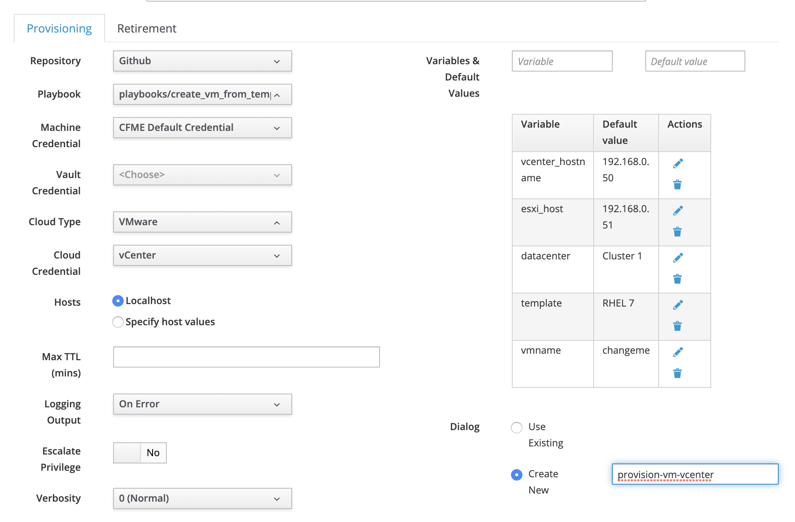

1. Click on ***Add*** to save the Service Catalog Item. It can take a few moments for the changes to be saved.

    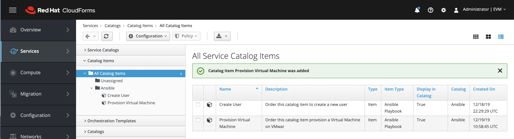

### Order the Virtual Machine Provisioning Service Catalog Item

Once more, we want to test the result and see everything works as expected.

1. Navigate to ***Services*** -> ***Catalogs***

    

1. Click on the Service Catalog Item we just created "Provision Virtual Machine"

    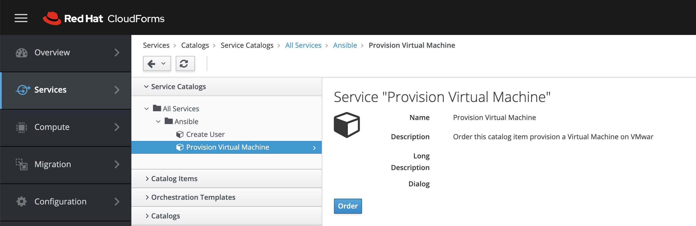

1. Click ***Order***

1. If you specified the dialog elements like described before, your form should look like this and all the provided default values can be accepted.

    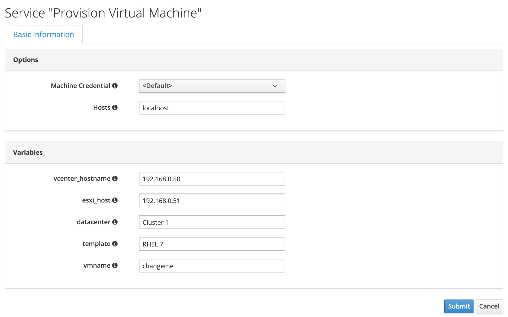

1. Click on ***Submit***

    After you click on "Submit" you will be redirected to the requests queue.

    

### Monitor VM provisioning Playbook execution

When executing an Ansible Playbook with the embedded role in CloudForms, a "Service" object is automatically created. This service object gives us more details about the executed Playbook. It provides the output of the Playbook and it allows us to trigger retirement.

1. Navigate to ***Services*** -> ***My Services***

    

1. You should see a new tile representing the Ansible Playbook Service you just ordered

    ***Note:*** If you don't see the tile yet, wait a minute and try again.

    

1. After clicking on the icon, we can see more details about the service which was created

    

    Since this Service does not create a Virtual Machine, the box "VMs" will always say "No Records found", even the playbook does

1. Click on the ***Provisioning*** tab to see the output of the Ansible Playbook

    

    If the Playbook execution has not completed, you can click the reload icon to refresh the information. The ***Reload*** icon is represented by a little arrow, left of the ***Configuration*** menu.

    
    -->

## Policies and Ansible

In section of the lab we will cover how to create an action in CoudForms that executes an Ansible Playbook. This is not meant to be a real world example, but instead, a way to demonstrate the power of Ansible in combination with the CloudForms control policies.

### Creating the Service

Control Policies drive Control Actions. Ansible Playbooks can now be executed as a control action, this is done by the control action calling a service. Therefore we need to create a service for the action to call.

First we need to create a Catalog to store the service in, do this by clicking Services/Catalogs and create new by clicking Configuration button and selecting Add New Catalog.

### Create a Service Catalog Item for the policy Playbook

1. Navigate to ***Services*** -> ***Catalogs***

    

1. Click on ***Catalog Items*** in the accordion on the left

    

1. Click on ***Configuration*** -> ***Add a New Catalog Item***

1. Select ***Ansible Playbook*** as "Catalog Item Type"

    

    ***Note:*** Do not select Ansible Tower! We do not use Ansible Tower in this lab, but the embedded Ansible role of CloudForms.

1. Fill out the form to define the service catalog item:

    ***Name:*** VM reset for CPU and Memory

    ***Description:*** Reconfigure VMware VM for CPU and Memory

    ***Display in Catalog:*** No (uncheck the box)

    ***Catalog:*** Ansible

    ***Repository:*** Github

    ***Playbook:*** vmware_reconfigure_vm.yml

    ***Machine Credentials:*** CFME Default Credentials

    ***Cloud Type*** VMware

    ***Cloud Credential*** vCenter

    In the box ***Variables & Default Values*** we can enter the variables the Playbook requires:

    ***Variable:*** vcenter_server

    ***Default:*** 192.168.0.50

    Click on the little plus icon (+) to save the variable. Repeat the process for the second variable:

    ***Variable:*** guest_server

    ***Default:*** cfme058

    Click on the little plus icon (+) to save the variable.

    ***Dialog:*** create new

    ***Dialog name:*** vm_reconfig

    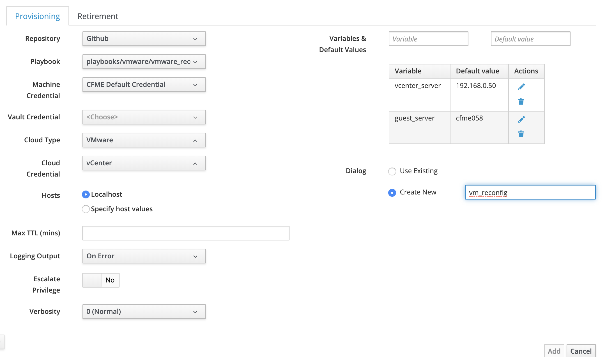

    Click on `Add` to save the catalog item.

### Creating Control Action

1. Navigate to ***Control*** -> ***Explorer*** and click on the ***Actions*** accordion

    

1. Click on the ***Actions*** accordion

    

1. Select Configuration/Add a new Action

    

1. Fill out the form as follows

    ***Description:*** Reset VM for CPU and Memory

    ***Action Type:*** Run Ansible Playbook

    ***Playbook Catalog Item:*** VM reset for Memory and CPU

    ***Inventory:*** Localhost

    Leave the inventory on “Localhost” this is because the playbook that is run as part of the service you created is to be ran on the CloudForms appliance. The other options are

    - Run the playbook in the service on the machine that raises the event.
    - Comma Delimited list of Hosts.

    

1. Click Add

    Next we will create the Policy to call the action. The use case that will be demonstrated is when a VM changes its hardware settings, CloudForms will change it back.

### Create VM Control Policy

1. Navigate to ***Policies** and then select ***VM Control Policies***

    

1. Select Configuration/Add a New VM and Instance Control policy

    

1. In the form you just need to provide the ***Description***

    ***Description:*** Reset VM for CPU and Memory

    

1. Click add

### Setting Event Assignment

1. Once added click Configuration/Edit this Events Assignment

    

1. Scroll down and select “VM Settings Change” under the VM Configuration

    

1. Click Save

### Setting Control Action on Event

1. Click on the Event that is now save to the policy

    

1. Select Configuration/Edit Actions for the Policy Event

    

1. Scroll the Available Actions For Conditions that are TRUE and move the Action you just created to the Selected Actions

    

1. Click Save

    The policy will react to events that are “VM Settings Change”, upon the event detected it will run the action “Reconfigure VMware VM for CPU and Memory” that is in turn a Service that is a Ansible Playbook.

### Creating and Assigning Policy Profile

For a policy to work, it needs a policy profile to be attached to. The policy profile also needs to be assigned to an object in CloudForms.

1. Navigate to ***Control*** -> ***Explorer*** -> ***Policy Profiles***

    

1. Click Configuration/Add New Policy Profile

    

1. Provide a ***Description***

    ***Description:*** Desired State Policies

1. Move the “VM and Instance Control: Reset VM for CPU and Memory” policy from available to Profile Policies list.

    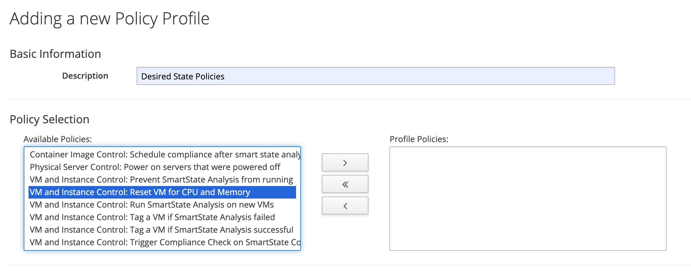

1. Click Save

### Assign the policy profile

1. Navigate to ***Compute*** -> ***Infrastructure*** -> ***Virtual Machines***

    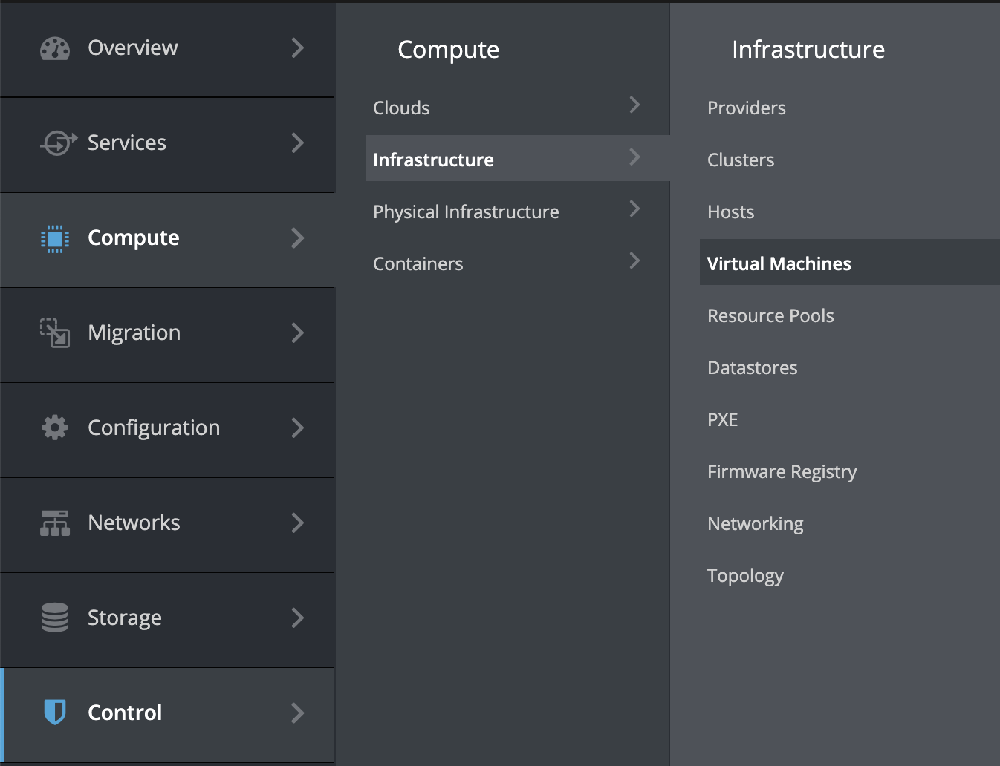

1. Select the VM cfme058

    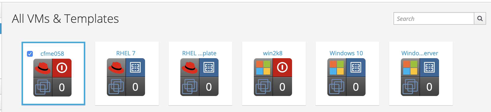

1. Go to ***Policy*** -> ***Manage Policies***

    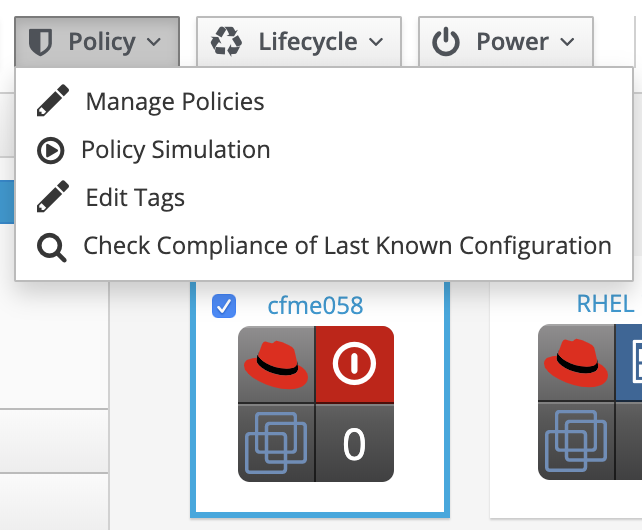

1. Select the “Desired State Policy Profile”

    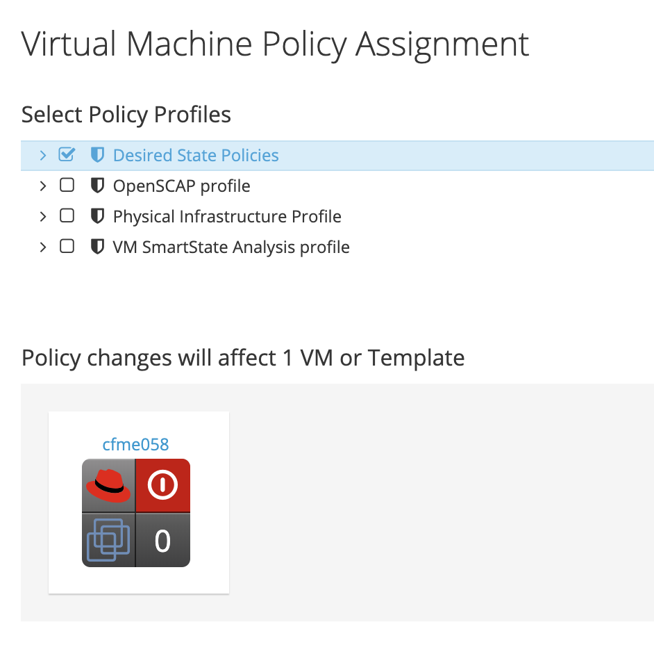

1. Click Save

    This has assigned the Desired State Policy Profile to the individual VM. When the VM is configured for CPU or Memory, CloudForms will reset it back to 1CPU and 1GB memory.

### Testing the Policy Profile

To see the results in real time, it's advised during testing to open the policy.log file on the CloudForms appliance. This shows when events are caught by CloudForms and confirms the policy matches.

1. Navigate to ***Compute*** -> ***Infrastructure*** -> ***Virtual Machines***

    

1. Select the VM cfme058

    

1. Click on ***Configuration*** -> ***Reconfigure Selected Items***
  
    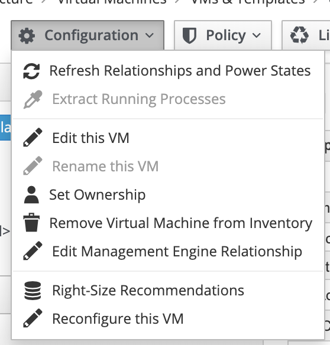

1. Slide Memory and select 3GB, slide Processors and select 2 Sockets

    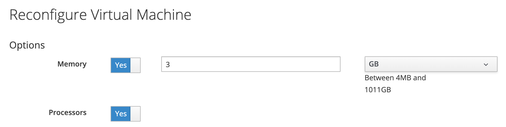

1. Click on Submit. This will take you to request, and you can see how the process of VM reconfiguration is kicked off and right after the playbook is executed. 

1. Click on Refresh to update the list of running requests. 

    

1. Navigate to ***Compute*** -> ***Infrastructure*** -> ***Virtual Machines***

    

1. Click on the VM cfme058 and verify that now it has 1GB of RAM and 1 CPU

    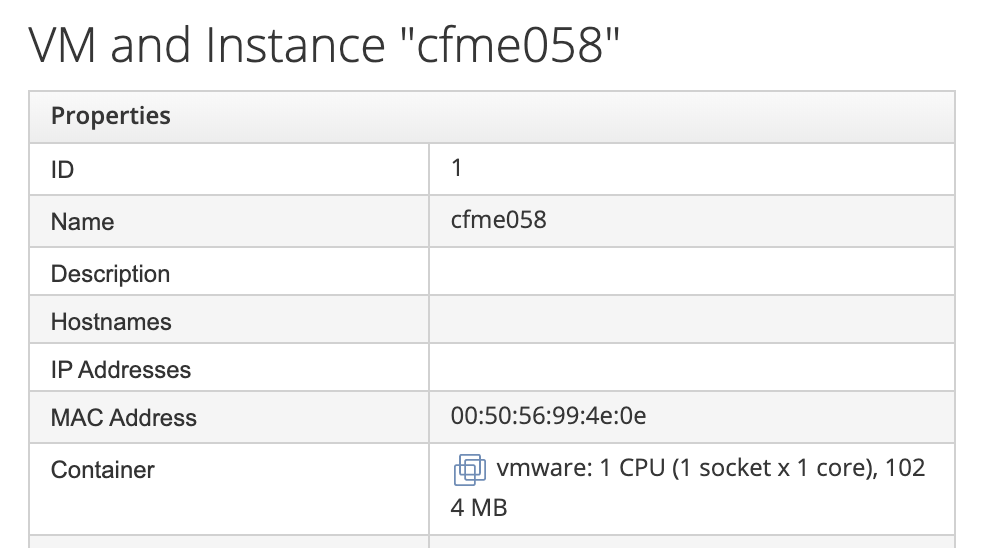

## Even more

If you're already done and still have some time left, here are some ideas for advanced labs:

- try to retire the "create user" service catalog item and see if the user is indeed deleted
- try to add other Playbooks, some examples can be found on the [Official Red Hat CloudForms Blog](http://cloudformsblog.redhat.com/2017/05/31/ansible-automation-inside-cloudforms/)
- retire the virtual machine Service you ordered earlier, check what happens during retirement with the virtual machine (Is it shutdown? Deleted? Is there still a representation in the CloudForms Web UI?)
- make the second Catalog Item available for Joe Doe as well
- improve the Service Dialog and make the VM Name a mandatory field (right now, it's optional and can be left empty)
- grant Joe Doe more privileges (for example, it would be nice if he could start and stop his virtual machines)
- upload items to make the Service Catalog more appealing
- use the new Self Service user Interface by trying the "/self_service" URL on your Appliance
